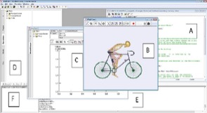

## I. Musculoskeletal analyse =
### 1. Basic concepts to use Anybody™ software

Anybody software user interface is composed of different parts.

  

{| class="wikitable  center"

{|  border="1" style="border: 1px solid black  width="50%";" 
 |-
 !Legend !! scope="col" | Window name !! scope="col" | Description
 |--
 | align="center" | A || align="center" |Editor Window ||Edition file windows *.any will contain the AnyScriptTM text.
 |----
 | align="center" | B || align="center" |Model View|| Graphic visualisation model window. ''Access: Window > Model View (new)''
 |----
 | align="center" | C || align="center" |AnyChart || Graphic results display. ''Access: Window > Chart 2D/3D (new)''
 |----
 | align="center" | D || align="center" |Main Tree Widow || Model and operations display: hierarchical representations of the model defined in A.
 |----
 | align="center" | E || align="center" |Log window || Information about calculation in progress, alerts and errors.
 |----
 | align="center" | F || align="center" |Progress Window || Information about processing analyse.
|}

 |}

The windows E and F are precious information about analysis processing:

* Warning : WARNING: [Concerned object about the warning] : [Warning description]
* Errors: ERROR: [Concerned file about the error] : [Concerned operation about the error] : [Error description] 
These windows are interconnected and the actions described below allow browsing between each of them:
* Double click on the object in the Model View B = Linked object displayed in the Main-Tree Window, tab Model (D)
* Right click on the object in the Main-Tree Window, tab Model (D) = Localization option in the Editor Window (A) (list appears)
* Right click on the object Editor Window (A) = « Locate in Model Tree » option to locate in the Main-Tree Window (D)

### 2. Menu

{| class="wikitable alternance center"

{|  border="1" style="border: 1px solid black  width="50%";" 
 |----
 ! Menu !! scope="col" | Icon !! scope="col" | Action
 |----
 | align="center" | File > Open... || align="center" |[[Image:Icone1.jpg]] || Open a new file *.any.
 |----
 | align="center" |File > New from Template || align="center" |[[Image:Icone2.jpg]]|| New model based on template
 |----
 | align="center" | File > New include || align="center" |[[Image:Icone3.jpg]] || New file *.any
 |----
 | align="center" | File > Save > Save all || align="center" |[[Image:Icone4.jpg]]|| Save all opened files
 |----
 | align="center" | Operation > Load Model || align="center" |[[Image:Icone5.jpg]] || Load the model
 |----
 | align="center" | Operation > Stop > Start > Break> Step || align="center" |[[Image:Icone6.jpg]] || Stop current operation. Start selected operation. Break. Start step to step operation.
|}

 |}

### 3. Operations to start analysis

The first step is loading the model (icon ‘Load Model’ describe above). 
Warning!! During the first loading be sure to load the ‘main’ file. To be sure, the easiest way is to follow these steps: 
* Select the ‘main’ file window to make it active  
* Click directly on ‘load model’ icon from the toolbar of this window  
When the model is loaded, different successive “operations’ allow the AnyBodyTM musculoskeletal analysis to start. Each defined operation in the processing model can be found in the Main-Tree Window, below the ‘Study’ button. To start an operation, select it and click on the ‘Start operation’ button.

 [[Image:operation.png]]
'''Figure 2''': AnyBody operations

 

In general, it is possible to run different operations:
* ''InitialConditions'': Apply initial condition. Allows analysis step by step 
* ''Calibration'': Calibrate the model. Allows to define optimum muscular parameters (ex: maximum force linked to the length).
* ''Kinematics'': Kinematic analysis. It is possible to run only kinematic analysis. In this case the results are not the resolution of kinematic equations, i.e forces are not concerned.
* ''Inverse dynamics'': Inverse dynamic analysis. During inverse dynamic musculoskeletal analysis, at each total movement step, the kinematics are calculated at first. Then, muscular and reaction forces are calculated by the second derivative kinematic position in the movement equation.

### 4. Macro automation

Other visible folders in the Main-Tree Window correspond to macros and allow the successive automated launch of different operations. Macros is an icon represented by a folder with two arrow keys to fast forward [[Image: fast.png]]on the right side. For example, the macro “RunApplication” (green rectangle in the [[#section|'''Figure 2''': AnyBody operations''']]) allows the launch of the following operations:

* Initial conditions (included in “CalibrationAnal”, which is itself a macro)
* Calibration 
* Inverse dynamic 

The useful macros for the LIOAnyShoulder model are described in the step by step guide below.
